## Boostech L-Line BMS protocol ##

One of my friends purchased a Peugeot 106 Electrique with a 42 cell LiFePO4 battery pack, equipped with a Boostech L-Line BMS system.

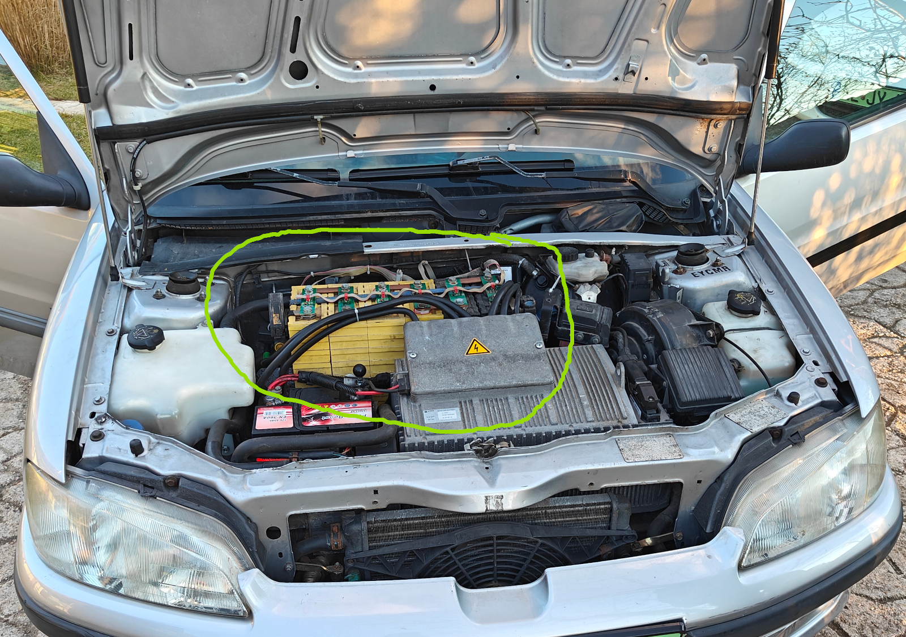

Our goal is to reverse engineer the protocol used in a Boostech L-Line BMS system and extract and log information from it.

We would like to log and understand the changes of the individual cell voltages over time/ higher current draw to get a more accurate overview from the status of the pack..

Yes, we could go out and just buy a [MasterUnit V3](https://shop4akku.de/bms-masterunit-v3/), but we are poor eastern europeans and where is the fun in that :D

### Physical layer ###

Bus idles at 5 Volt, master pulls it to +12V slave (BMS boards, current meter, temperature meter pulls it to GND).

A simple comparator circuit hda been built to interface a Saleae Logic (and some random microcontroller in the future) with the bus:

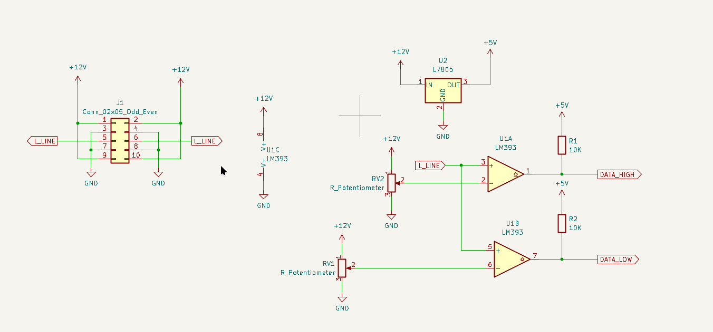

[Kicad schematic is available here along with a partially reverse engineered BMS board.](lline_interface)

### Protocol ###

The protocol is mastered likely by the bus relay, at least the polls by the master are performed even if the display unit is not disconnected.?

By default it looks to poll all devices with roughly 1 sec intervals:

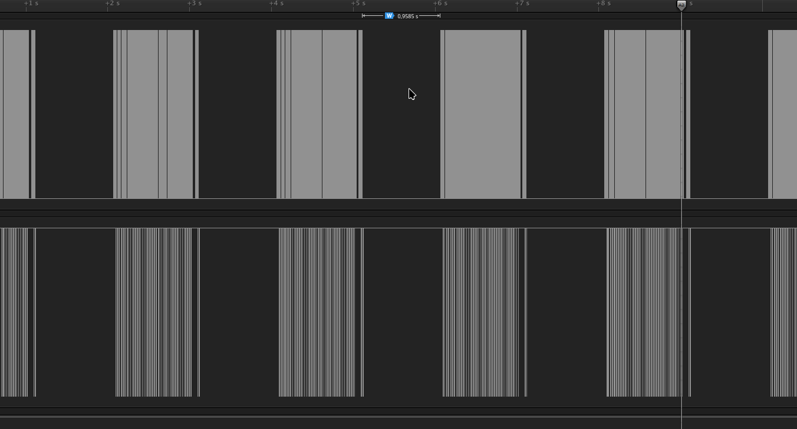

With BMS disconnections we were able to determine the answers in the responses:

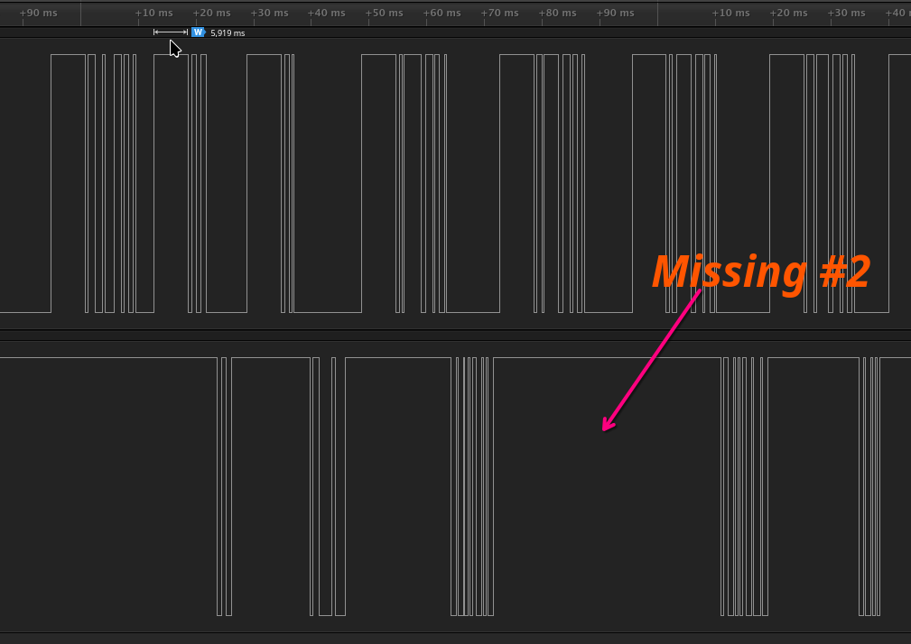

So the responses are sent after a certain preamble in the order the BMS cells are addressed:

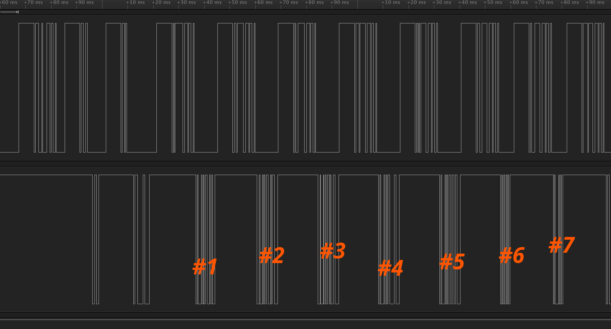

If you go into the single cell monitoring menu only one BMS is getting polled with ~1 sec interval:

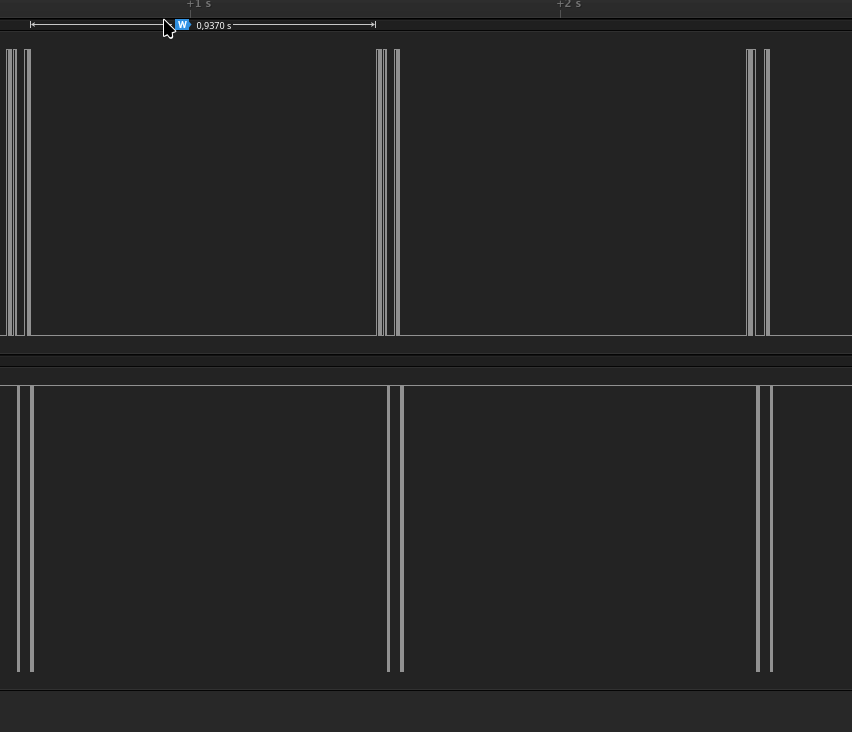

We also managed to locate the temp sensor's response:

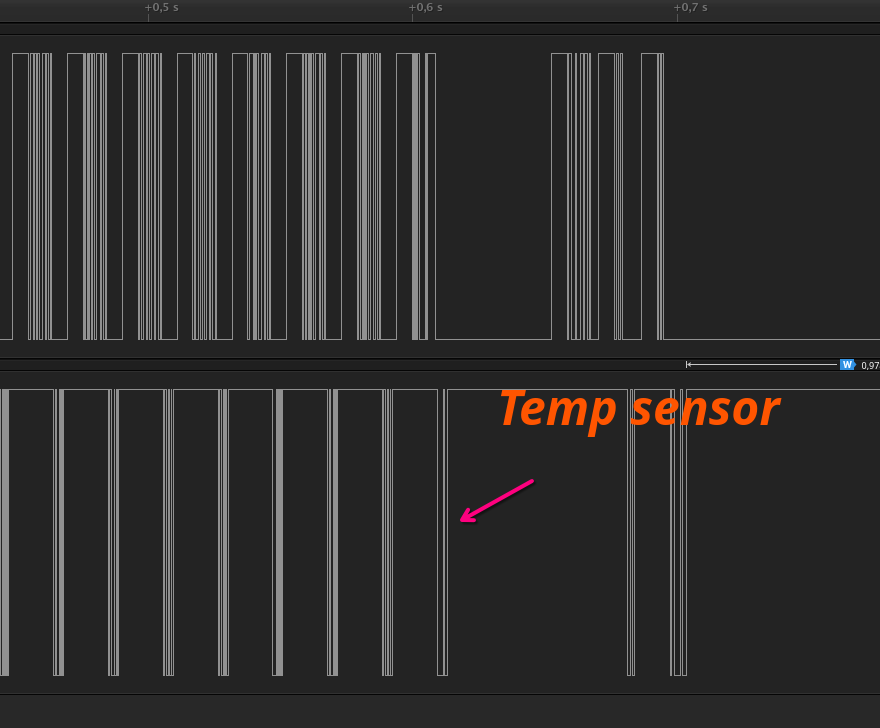

By peeking at the protocol the following can be known:

- This is a bit banged async protocol (in the display unit the PIC16F876 UART is not utilized)

- It has a some sort of preamble (maybe for clock sync)

##### Protips for waveform comparison based visual reverse engineering #####

I have used the Saleae Logic 1.2.40 for visually inspecting the protocol. Yes still 1.x in 2025, but the 2.x is an useless crap after many years of development...

To being able to visually compare the waveforms I do use the following method:

I 'select' the similar waveforms with measurement: hit 'M' and click on the first and last edge to inspect:

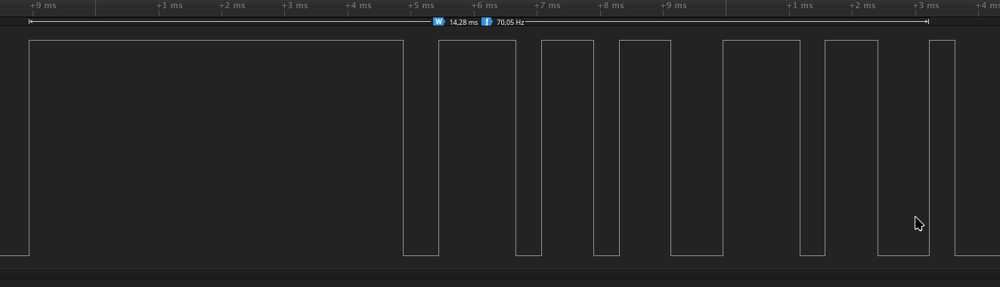

Then click on the fit measurement to view:

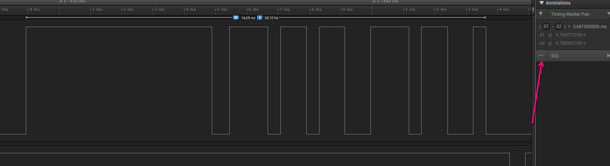

Open up the same recording in a new tab and perform the same selection.

You can inspect the waveforms by switching tabs.

#### Host queries ####

All the host queries to the BMS boards has the following format:

- Prefix
- Address
- Suffix

##### Host prefix #####

The host prefix consist from a ~5900 us high, ~580 us low, ~410 us high impulse:

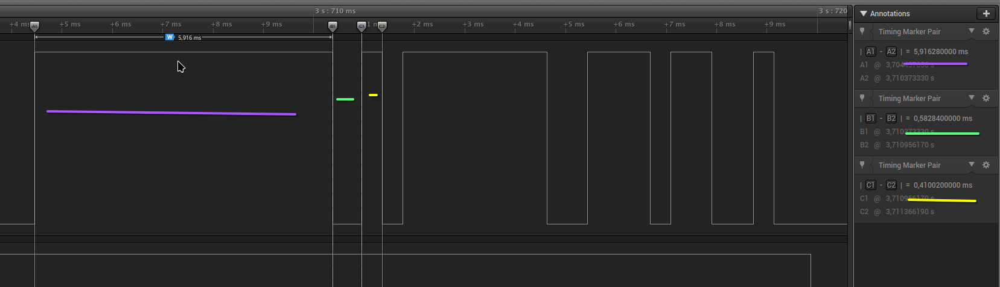

##### Address #####

The address part consists from 8 ~410 us bit places, where the LSB transmitted first in inverted polarity:

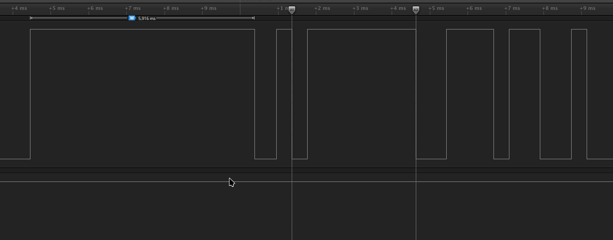

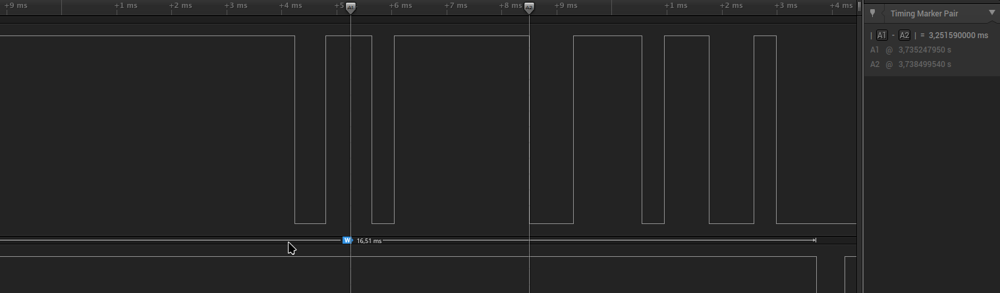

The address of the temperature sensor is 245:

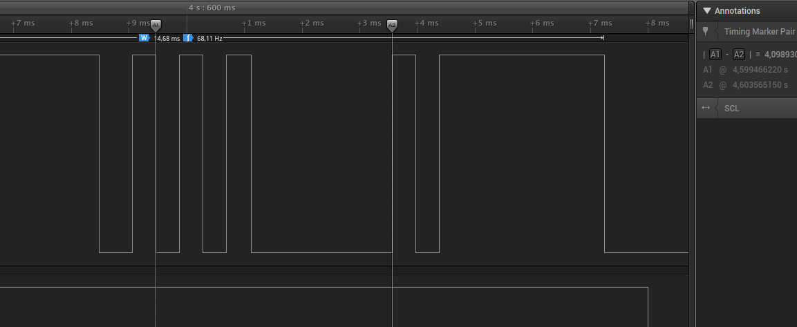

##### Host suffix #####

For the host the ~410 us looks to be the bit time.

For all the BMS boards the following 9 bit trail is sent:

3 bit high, 1 bit low, 2 bit high, 2 bit low 1 bit high
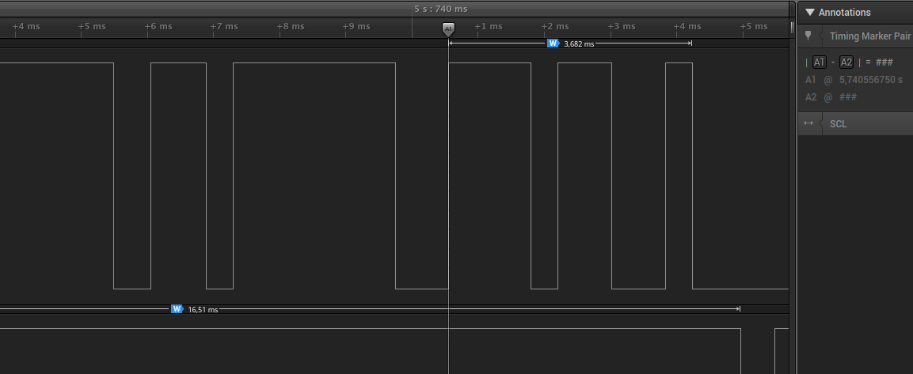

For the temperature sensor the suffix is diffenent:

1 bit high, 1 bit low, 7 bit high
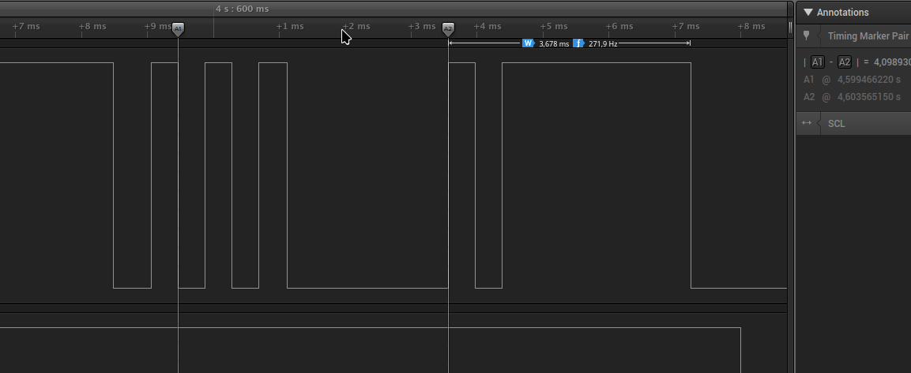

#### BMS boards responses ####

We have two type of BMS boards: an older and a likely newer ones

The newer ones has a longer answer, older has shorter

